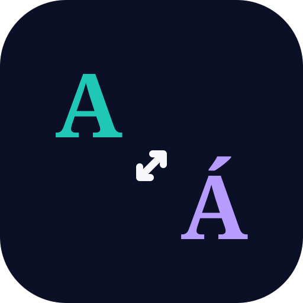
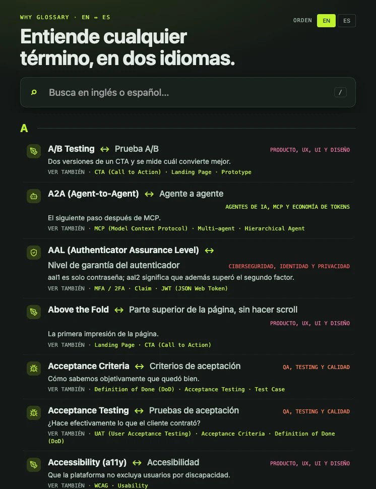
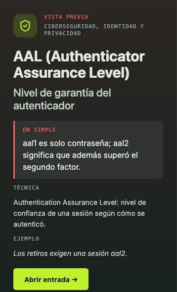
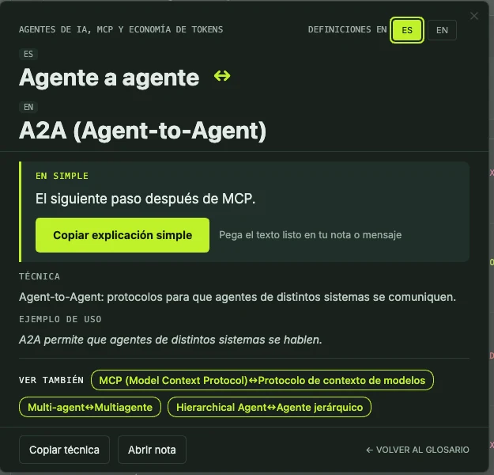
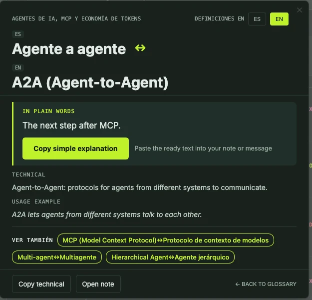
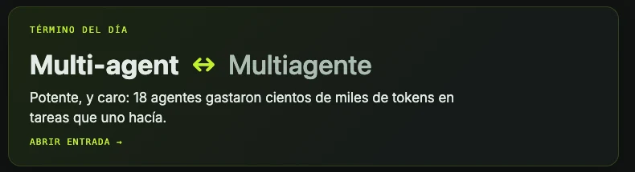
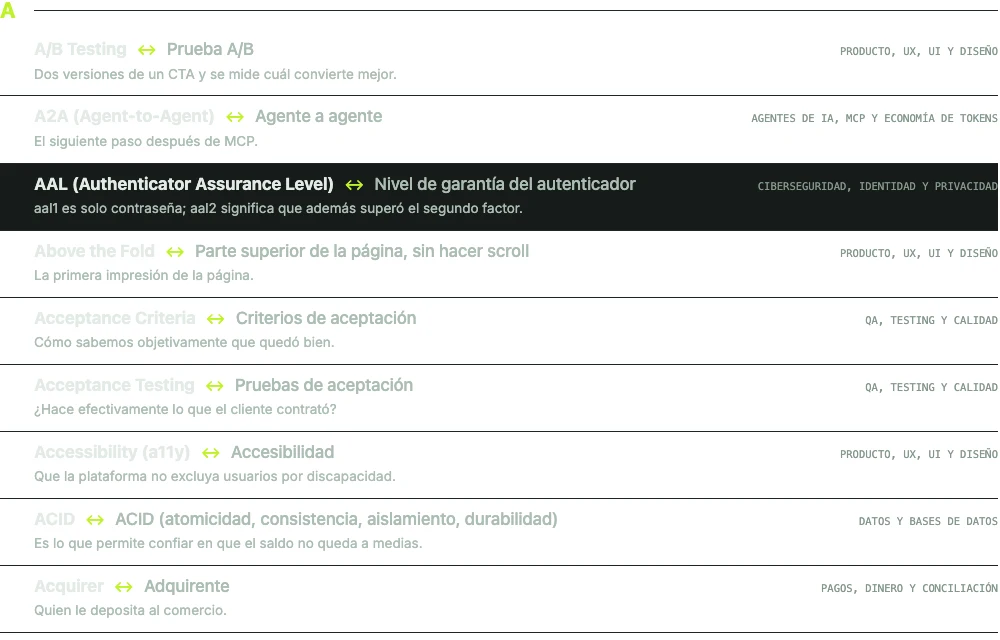
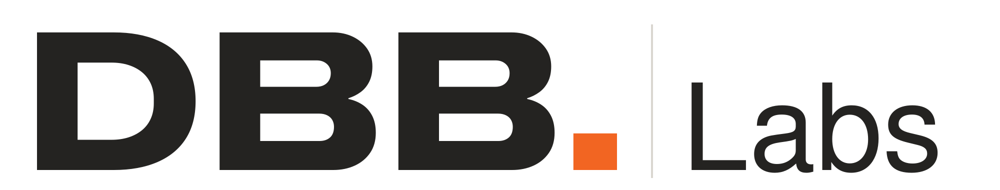

<div align="center">



# Why Glossary

**A pocket glossary that speaks both languages: look a term up in English or Spanish, and read it in plain words.**

almost 400 ready-made terms · add your own · works with any vault

[](https://github.com/DBB-FC/why-glossary/releases/latest)
[](https://obsidian.md)
[](#install)
[](LICENSE)
[](#everything-else)

*English · [Leer en español](README.es.md)*

<a href="https://www.buymeacoffee.com/DbbLabs" target="_blank"></a>



<sub>Real screenshots from a real vault, no mock-ups. Search in English or Spanish; each term shows both names and the plain definition.</sub>

</div>

---

Half the words in tech, product and data are English, and most explanations of them assume you
already know them. Why Glossary puts the answer one keystroke away, in both languages: **a
plain-words definition, a technical one, and an example** — for the term you typed, in the language
you typed it.

Not a web page. Not an AI guess. Notes in your own vault, that you can read, edit and extend.

|   |   |
|---|---|
| **[What it does](#what-it-does)** · the four things you get | **[Install](#install)** · two minutes |
| **[First run](#first-run-in-one-minute)** · nothing to configure | **[Add your own terms](#add-your-own-terms)** · *Ingresá tus términos* |
| **[What is in the base glossary](#what-is-in-the-base-glossary)** · read this before installing | **[Everything else](#everything-else)** · settings, privacy, build |

## What it does

<table>
<tr><td width="50%"></td><td width="50%"></td></tr>
<tr><td><b>One screen, both languages.</b> Type <code>latency</code> or <code>latencia</code>: the result shows both names, the plain definition and related terms.</td><td><b>Preview without opening.</b> Click any row and the panel on the right shows the plain, technical and example versions.</td></tr>
<tr><td></td><td></td></tr>
<tr><td><b>Plain first.</b> A one-line explanation anyone can follow, a button to copy it into your note, then the technical version and an example.</td><td><b>Switch language in one click.</b> The same card, the definitions in English or Spanish; related terms are links.</td></tr>
</table>



<sub><b>Term of the day.</b> A card on the glossary screen brings up one term a day, so the glossary also teaches while you are not looking for anything.</sub>

- **Search in either language.** Type `latency` or `latencia`, with or without accents. One result
  shows both names and the definition in the language you chose.
- **Two levels of definition.** A *plain* one anyone can follow, a *technical* one for when you
  need the precise version, and an example in context. Related terms are one click away.
- **Hover in reading mode.** Glossary terms are underlined in your notes; point at one and the
  card appears, without leaving the page.
- **Study mode.** Flash cards from your own glossary, in sessions of the size you pick, with the
  ones you missed coming back first.

<details>
<summary><b>More views</b></summary>



<sub>The A–Z list: the dark row is the keyboard selection, and every row shows both names and the plain definition.</sub>

</details>

And also: an A–Z screen with domain filters · a side panel that stays open while you write ·
**English and Spanish**, one setting · **the phone**, same screens, no separate build.

## Install

**From the community directory** — Community plugins → Browse → search **Why Glossary** → Install → Enable.

<details>
<summary>Other two ways: BRAT, or by hand</summary>

### With BRAT — installs and keeps updating itself

1. Install **Obsidian42 - BRAT** from the community plugins.
2. Command palette → **BRAT: Add a beta plugin for testing**.
3. Paste `DBB-FC/why-glossary`.

BRAT installs it, enables it, and updates it on every release.

### By hand

Download `main.js`, `manifest.json` and `styles.css` from the
[latest release](https://github.com/DBB-FC/why-glossary/releases/latest) into
`<vault>/.obsidian/plugins/why-glossary/`, then enable it in Settings → Community plugins.
Nothing else is needed: those three files are the whole plugin.

</details>

Open it with the command **Abrir glosario** (`Cmd/Ctrl+P`) or the book icon in the left ribbon.

## First run, in one minute

1. **Enable the plugin.** The base glossary installs itself into a `Why Glossary/` folder —
   almost 400 notes, no wizard, no key, no network.
2. **Open the glossary** from the ribbon, and type any word: `chargeback`, `contracargo`, `latency`.
3. **Click a result** to read the plain definition, the technical one and the example.
4. **Point at an underlined term** in any note in reading mode to see its card.

That's it. No configuration needed for any of the above.

## Add your own terms

The base glossary is a starting point; the useful glossary is yours. Three ways in, all the same
thing underneath:

- the **Ingresá tus términos** command (`Cmd/Ctrl+P`),
- the button on the glossary screen,
- the *Tus términos* row in the plugin settings.

Only the English and Spanish names are required. Your term is saved as a note in
`Why Glossary/Mis términos/`. You can also write the note by hand:

```yaml
---
en: "Chargeback"
es: "Contracargo"
aliases: ["Disputa de pago"]
dominio: "My terms"
simple_es: "Cuando un cliente reclama un cobro a su banco y el banco le devuelve la plata."
simple_en: "When a customer disputes a charge with their bank and the bank returns the money."
tecnica_es: "…"
tecnica_en: "…"
ejemplo_es: "…"
ejemplo_en: "…"
ver_tambien: ["Refund"]
---
```

Every field except `en` and `es` is optional.

## What is in the base glossary

**Almost 400 terms** across eleven areas: AI agents and token economics, web development and software
architecture, commercial and consulting work, data and databases, security and privacy, cloud and
DevOps, AI and automation, product and design, payments, QA, and SaaS and integrations.

Definitions are written to stand on their own, for a general audience, and are **not a substitute
for a specialist** — the plain version simplifies on purpose. Terms flagged `verificar` in their
frontmatter are ones whose translation deserves a second pair of eyes; if you spot a mistake,
[open an issue](https://github.com/DBB-FC/why-glossary/issues).

The base glossary never overwrites your notes: edit a term and your version stays. *Instalar el
glosario base* in settings restores anything you deleted.

## Everything else

<details>
<summary><b>Settings</b></summary>

- **Carpeta del glosario** — where the term notes live (default `Why Glossary`).
- **Idioma de las definiciones** — English or Spanish; if one is missing, the other is shown.
- **Ver definición al pasar el cursor** — the hover cards in reading mode.
- **Abrir el glosario al iniciar Obsidian** — the glossary screen opens with the vault.
- **Tus términos** and **Glosario base** — add a term; install or restore the base terms.
- **Tarjetas por sesión de estudio** — size of a study session.

</details>

<details>
<summary><b>Privacy</b></summary>

There is no telemetry, no analytics, no account and no server: the plugin makes **no network
request at all**. It reads and writes only the notes inside its own folder. Your study history and
the cards you missed are stored in the plugin's own settings file.

</details>

<details>
<summary><b>Build from source</b></summary>

```bash
npm install
npm test         # builds a test bundle and runs the unit tests
npm run typecheck
npm run build    # → main.js
```

The base glossary lives in `starter/` and is bundled into `main.js` at build time. `main.js` is the
build output and is not committed — releases carry it.

</details>

<details>
<summary><b>Licence</b></summary>

[MIT](LICENSE). Free for anything — personal or commercial — and you may fork it, change it and
redistribute it, keeping the copyright notice. The plugin charges nothing and has no paid tier.

</details>

## Support

Bugs and ideas: [GitHub issues](https://github.com/DBB-FC/why-glossary/issues). Include your
Obsidian version and your platform.

[Contributing](CONTRIBUTING.md) · [Code of conduct](CODE_OF_CONDUCT.md) · [Security](SECURITY.md) · [MIT licence](LICENSE)

---

<div align="center">

<a href="https://dontbuybuild.cl">
  <picture>
    <source media="(prefers-color-scheme: dark)" srcset="docs/imagenes/dbb-labs-oscuro.svg">
    
  </picture>
</a>

Built by **Felipe Córdova** · Powered by **[DBB Labs](https://dontbuybuild.cl)**

### Don't Buy. Build.

<sub>That is the company's name, not a slogan: a studio of custom systems.<br>Buy what is standard. Build what is strategic.</sub>

<sub>Free, MIT, no paid tier. If the glossary saved you a search, a beer is welcome —
and if it did not, the plugin still works exactly the same.</sub>

<a href="https://www.buymeacoffee.com/DbbLabs" target="_blank"></a>

</div>
